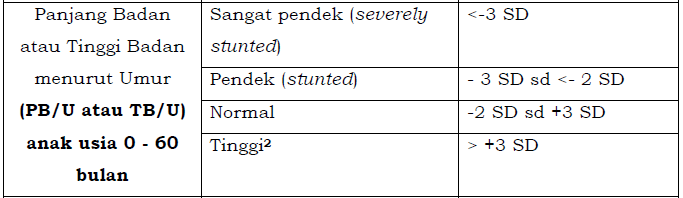

# Dokumentasi Kode: Klasifikasi Status Gizi dan Stunting Anak

Kode ini bertujuan untuk mengklasifikasikan status gizi anak berdasarkan tinggi badan (panjang badan) dan berat badan. Hal ini dilakukan dengan membandingkan data anak dengan standar WHO yang disimpan dalam file CSV. Berikut adalah penjelasan dan dokumentasi dari kode yang diberikan.

Penentuan tingikat keyakinan (level of confidence) berdasarkan **panjang badan atau tinggi badan menurut umur** dan **berat badan menurut panjang badan dan tinggi badan**.

pengukuran data berdasarkan **panjang badan atau tinggi badan menurut umur** dapat dilakukan dengan melihat tabel [rule_l.csv](/rule_l.csv) (untuk laki-laki) dan [rule_p.csv](/rule_p.csv) (untuk perempuan).



_Tabel 1 mengukur panjang badan atau tinggi badan menurut umur._

pengukuran data berdasarkan **berat badan menurut panjang badan dan tinggi badan** dapat dilakukan dengan melihat tabel [rule2_l.csv](/rule2_l.csv) (untuk laki-laki) dan [rule2_p.csv](/rule2_p.csv) (untuk perempuan).


_Tabel 2 mengukur berat badan menurut panjang badan dan tinggi badan._


# Penjelasan mekanisme perhitungan menggunakan sistem yang telah dirancang

## Import Library

```python
import pandas as pd
```

Kode menggunakan library `pandas` untuk memudahkan manipulasi data dari file CSV yang berisi standar klasifikasi status gizi dan stunting anak.

## Kelas `ReadTabel`

Kelas ini berfungsi untuk memuat data standar gizi dari file CSV dan menentukan status gizi atau stunting anak berdasarkan usia, panjang badan, dan berat badan.

### Metode `__init__`

```python
def __init__(self) -> None:
    pass
```

Metode ini adalah konstruktor dari kelas `ReadTabel`, tidak melakukan inisialisasi data khusus.

### Metode `check_gender`

```python
def check_gender(self, gender):
    if gender.lower() == "l":
        file_path = "rule_l.csv"
        file_path2 = "rule2_l.csv"
        return file_path, file_path2
    elif gender.lower() == "p":
        file_path = "rule_p.csv"
        file_path2 = "rule2_p.csv"
        return file_path, file_path2
    else:
        raise Exception("gender input must l for male (laki-laki) or p for female (perempuan)")
```

Metode ini menentukan file CSV yang akan dibaca berdasarkan jenis kelamin anak. File ini berisi standar gizi untuk laki-laki (`l`) dan perempuan (`p`).

### Metode `load_rules`

```python
def load_rules(self, file_path):
    df = pd.read_csv(file_path)
    df.columns = ['USIA', '-SD 3', '-SD 2', '-SD 1', 'Median', '+SD 1', '+SD 2', '+SD 3']
    df['USIA'] = pd.to_numeric(df['USIA'], errors='coerce')  # Ubah ke numerik untuk kolom 'USIA'
    return df
```

Metode ini memuat data standar gizi dari file CSV dan memastikan bahwa kolom `USIA` diubah menjadi tipe data numerik untuk memudahkan perhitungan.

### Metode `find_closest_age`

```python
def find_closest_age(self, age, rules_df):
    closest_age = rules_df.iloc[(rules_df['USIA'] - age).abs().argmin()]
    return closest_age
```

Metode ini mencari baris dengan usia terdekat dalam dataframe standar gizi untuk dilakukan perbandingan.

### Metode `stunting_status_by_age_height`

```python
def stunting_status_by_age_height(self, age, height, rules_df):
    closest_age_row = self.find_closest_age(age, rules_df)        
    try:
        sd_3 = closest_age_row['-SD 3']
        sd_2 = closest_age_row['-SD 2']
        sd_0 = closest_age_row['Median']
        sd_3_plus = closest_age_row['+SD 3']
    except KeyError as e:
        raise KeyError(f"Kolom yang diperlukan tidak ditemukan: {e}")

    if height < sd_3:
        return 1, "Sangat Pendek"
    elif sd_3 <= height < sd_2:
        return 0.8 , "Pendek"
    elif sd_2 <= height <= sd_3_plus:
        return 0.6,  "Normal"
    else:
        return 0.4, "Tinggi"
```

Metode ini menentukan status stunting berdasarkan tinggi badan dan usia. Status didasarkan pada pembagian standar deviasi (SD) dari data WHO:

- **Sangat Pendek**: Tinggi badan di bawah -SD 3
- **Pendek**: Tinggi badan antara -SD 3 dan -SD 2
- **Normal**: Tinggi badan antara -SD 2 dan +SD 3
- **Tinggi**: Tinggi badan di atas +SD 3

### Metode `load_rules2`

```python
def load_rules2(self, file_path):
    df = pd.read_csv(file_path)
    df.columns = ['Panjang Badan (cm)', '-3 SD', '-2 SD', '-1 SD', 'Median', '+1 SD', '+2 SD', '+3 SD']
    
    for col in df.columns[1:]:
        df[col] = pd.to_numeric(df[col], errors='coerce')  # Ubah ke numerik, coerce ubah error jadi NaN
    
    return df
```

Metode ini memuat data standar berat badan berdasarkan tinggi badan, dengan memastikan bahwa data selain kolom tinggi badan diubah ke tipe numerik.

### Metode `find_closest_height2`

```python
def find_closest_height2(self, height, rules_df):
    rules_df['Panjang Badan (cm)'] = pd.to_numeric(rules_df['Panjang Badan (cm)'], errors='coerce')
    closest_row = rules_df.iloc[(rules_df['Panjang Badan (cm)'] - height).abs().argmin()]
    return closest_row
```

Metode ini mencari tinggi badan terdekat dalam dataframe standar berat badan untuk dilakukan perbandingan.

### Metode `stunting_weight_by_height`

```python
def stunting_weight_by_height(self, height, weight, rules_df):
    closest_row = self.find_closest_height2(height, rules_df)
    
    sd_3_minus = closest_row['-3 SD']
    sd_2_minus = closest_row['-2 SD']
    sd_1_plus = closest_row['+1 SD']
    sd_2_plus = closest_row['+2 SD']
    sd_3_plus = closest_row['+3 SD']

    if weight < sd_3_minus:
        return 1, "Gizi Buruk"
    elif sd_3_minus <= weight < sd_2_minus:
        return 0.8, "Gizi Kurang"
    elif sd_2_minus <= weight <= sd_1_plus:
        return 0.6, "Gizi Baik"
    elif sd_1_plus < weight <= sd_2_plus:
        return 0.4, "Berisiko Gizi Lebih"
    elif sd_2_plus < weight <= sd_3_plus:
        return 0.2, "Gizi Lebih"
    else:
        return 0.8,  "Obesitas"
```

## inisiasi instance class ReadTabel

```python
rt = ReadTabel()
```

Metode ini menentukan status gizi anak berdasarkan berat badan dan tinggi badan. Status didasarkan pada standar deviasi berat badan:

- **Gizi Buruk**: Berat badan di bawah -3 SD
- **Gizi Kurang**: Berat badan antara -3 SD dan -2 SD
- **Gizi Baik**: Berat badan antara -2 SD dan +1 SD
- **Berisiko Gizi Lebih**: Berat badan antara +1 SD dan +2 SD
- **Gizi Lebih**: Berat badan antara +2 SD dan +3 SD
- **Obesitas**: Berat badan di atas +3 SD

## Penggunaan Kode

Contoh penggunaan kode ini adalah untuk menentukan status stunting dan gizi anak berdasarkan usia, tinggi badan, dan berat badan.

### Menentukan Tingkat Stunting Berdasarkan Usia dan Tinggi Badan

```python
jenis_kelamin = "l" # l untuk laki-laki
umur = 10 # umur 10 bulan
panjang_badan_atau_tinggi_banad = 8

rule_df1, _ = rt.check_gender(jenis_kelamin)
rules_data = rt.load_rules(rule_df1)
nilai, status = rt.stunting_status_by_age_height(umur, panjang_badan_atau_tinggi_banad, rules_data)
print("Nilai kemungkinan anak mengalami stunting dari panjang atau tinggi badan:", nilai)
print("Status anak", status)
```

### Menentukan Tingkat Stunting Berdasarkan Tinggi dan Berat Badan

```python
berat_badan = 9.2 # berat badan anak
_, rule_df2 = rt.check_gender(jenis_kelamin)
rules_data2 = rt.load_rules2(rule_df2)
nilai, status = rt.stunting_weight_by_height(panjang_badan_atau_tinggi_banad, berat_badan, rules_data2)
print("Nilai kemungkinan anak mengalami stunting dari berat badan:", nilai)
print("Status anak", status)
```

Dengan kedua metode di atas, status stunting dan status gizi anak dapat dihitung dan dibandingkan dengan standar WHO.